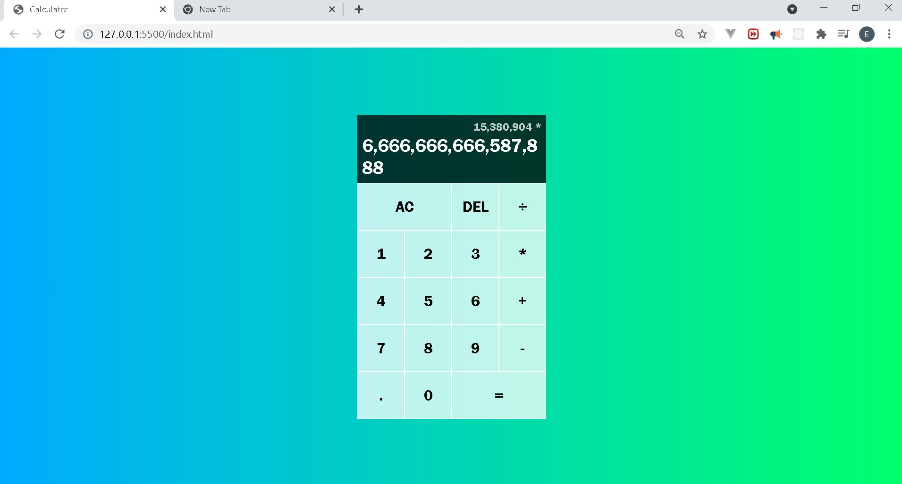

# Calculator App

## Overview

In this project a web application of a calculator its created using javascript, html and css.

## Source of the project

Web dev simplified: https://www.youtube.com/watch?v=j59qQ7YWLxw

## Screenshot of the project

## Link to the project

calculator-v1-2021-js.netlify.app

## Key topics

The following topics are covered in the
creation of the project:

- HTML
  - Files structure
  - Best practices
  - Handling of JS files
- CSS
  - Files structure
  - Best practices
  - Grid/flex
- Javascript
  - Handling of events
  - DOM manipulation
