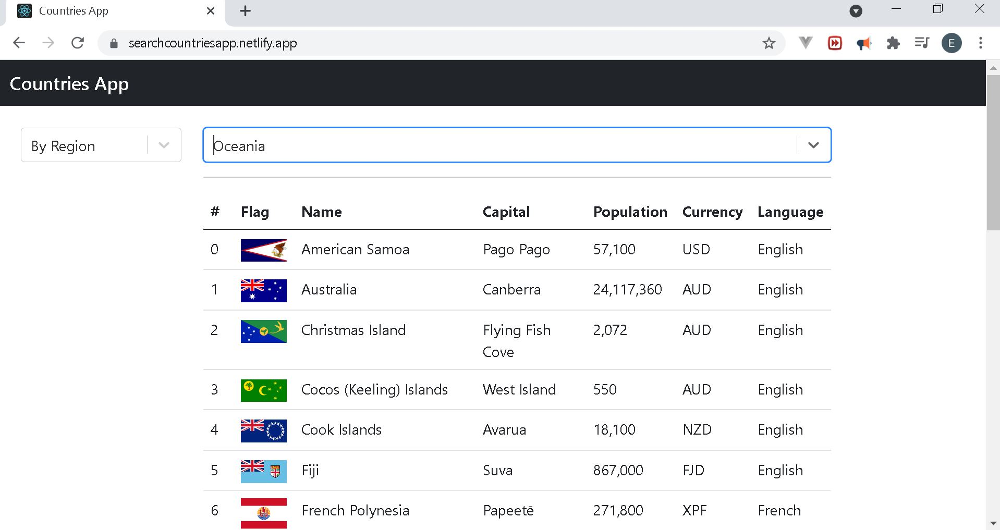

# Countries App

## Overview

In this project, a web application is developed that displays information about different countries depending
on the type of search selected. The information is obtained through an API.

## Link of the project

https://searchcountriesapp.netlify.app/

## Screenshot of the project

## Source API

https://restcountries.eu/

## Key topics

The following topics are covered in the
creation of the project:

- React
  - React-Select
  - Class components
  - Event handling
  - Conditional rendering
  - List Rendering
- Axios
  - GET request
  - Error handling
- Bootstrap
  - Form styling
  - Table styling
- Javascript
  - Handling of events

## How to use the app

First, the type of search is needed to be selected. In this case, the following types are available:

- By Country
- By Region
- By Capital

If Country or capital are selected, a search bar is visible to input the request. If there is no response from the
API, an error shows on the screen to review the query and try again. If a partial name is writen down, then the response will show the results that contain those letters requested

If By Region is selected, a new select bar is shown that contains all the available countries in the region.
