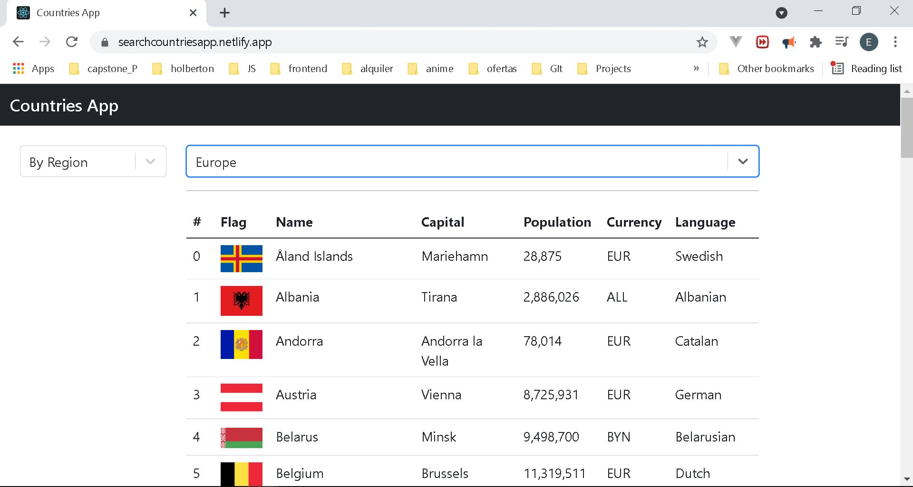

# Countries App

## Overview

In this project a web application is developed using several tools to automatize the creation of css and js files for deployment.

## Link of the project

https://searchcountriesapp.netlify.app/

## Screenshot of the project

## Key topics

The following topics are covered in the
creation of the project:

- React
  - Files structure
  - Best practices
  - Use of videos and images
- Axios
  - Libraries installations
  - Main file creation and set up
  - Automatization of tasks
  - Minifier of files
- Bootstrap
  - Files structure
  - Best practices
  - Set up file
- Javascript
  - Handling of events

## How to use the app
