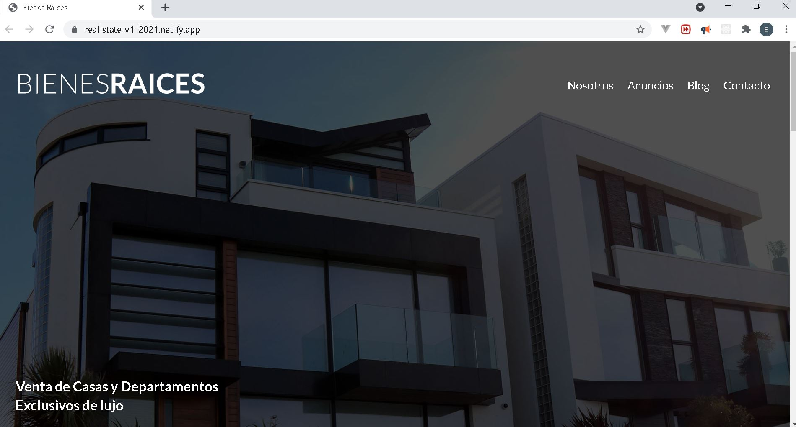

# Real State web page

## Overview

This project is a web page example that attemps to show information about real state for sale.

## Link of the project

real-state-v1-2021.netlify.app

## Screenshot of the project

## Source of the project

Udemy Course: Desarrollo Web Completo con HTML5, CSS3, JS AJAX PHP y MySQL

## Key topics

The following topics are covered in the
creation of the project:

- HTML
  - Images
  - Links
  - Class and id
  - Lists
- CSS
  - Display flex
  - @media
  - Font types
