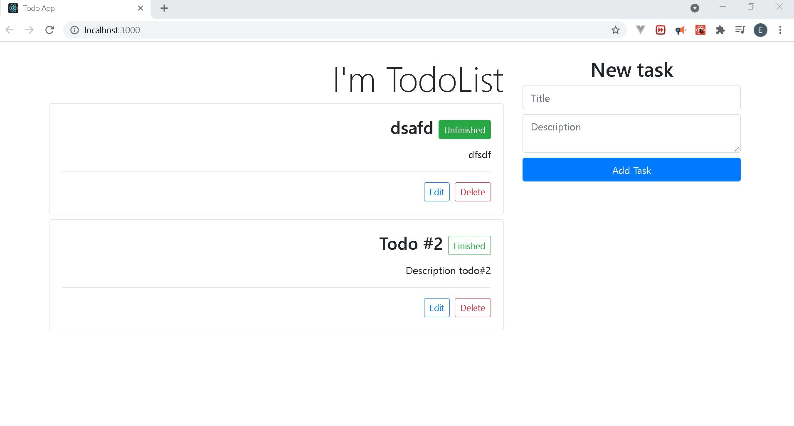

# Todo App V2

## Overview

This project is a web app for a todo list. You can create tasks, modify them and delete them.

## Link of the project

todov2-2021.netlify.app

## Screenshot of the project

## Source of the project

https://www.youtube.com/watch?v=Bh7j2upPAT8

## Key topics

The following topics are covered in the
creation of the project:

- React
  - Hooks: useState, useEffect
  - Functional components
  - Event handling
  - Conditional rendering
- Bootstrap
  - Cards styling
  - Form styling
- Javascript
  - Handling of events
  - LocalStorage
